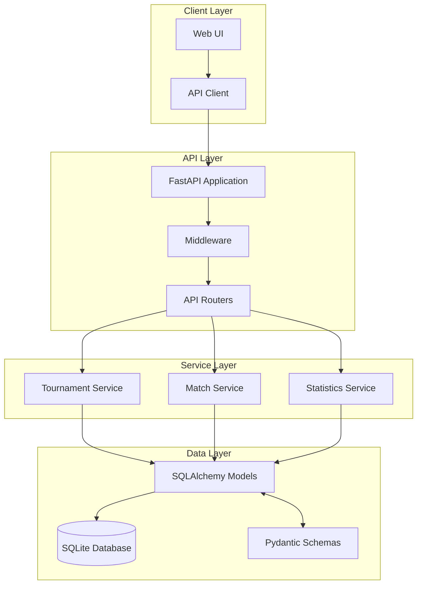
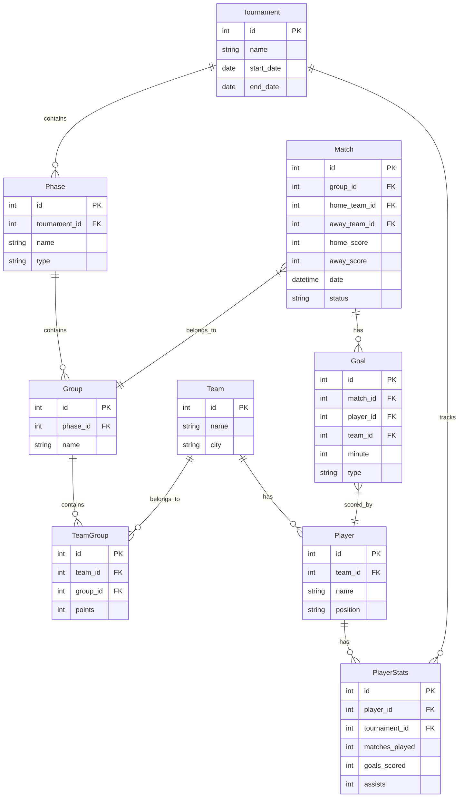
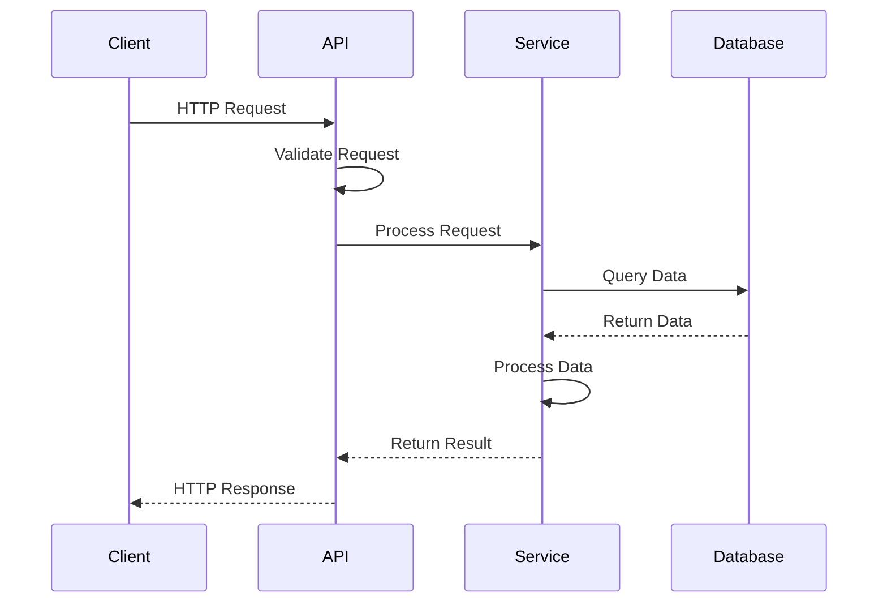
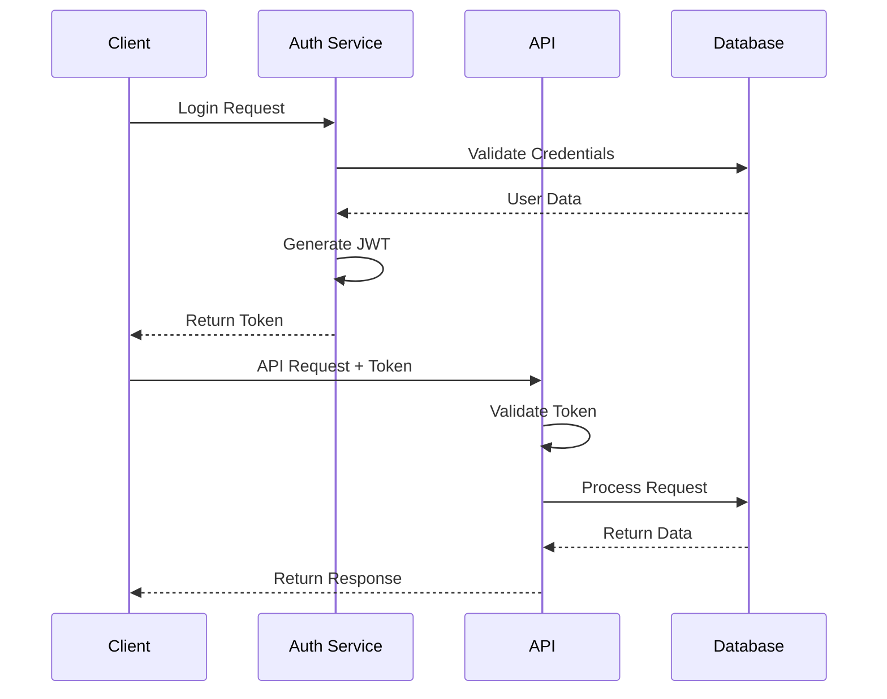
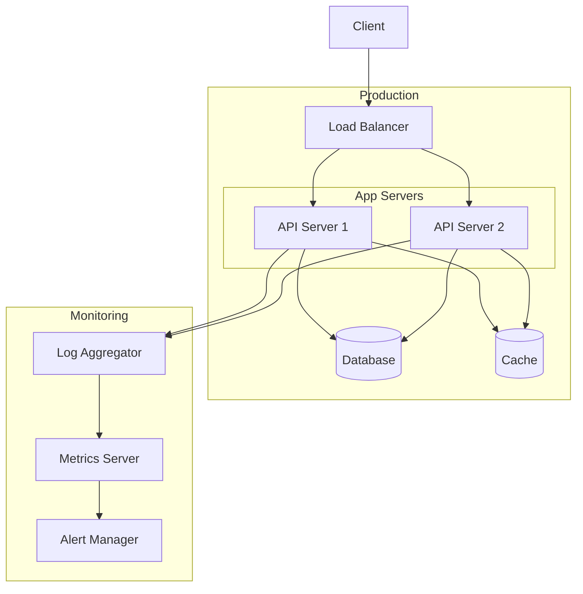

# System Architecture

This document outlines the architecture of the Soccer Tournament Management System.

## System Overview

## Database Schema

## Component Interaction

## Authentication Flow

## Deployment Architecture

## Design Decisions

### 1. Database Choice
- SQLite for development simplicity
- Easy migration path to PostgreSQL for production
- Built-in support in SQLAlchemy

### 2. API Design
- RESTful architecture for simplicity and familiarity
- FastAPI for automatic OpenAPI documentation
- Pydantic for request/response validation

### 3. Authentication
- JWT-based authentication
- Token refresh mechanism
- Role-based access control

### 4. Performance Considerations
- Database indexing on frequently queried fields
- Caching for static data
- Pagination for large result sets

### 5. Scalability
- Stateless API design
- Horizontal scaling capability
- Database connection pooling

## Technology Stack

1. **Backend Framework**
   - FastAPI (ASGI)
   - Uvicorn server

2. **Database**
   - SQLite (Development)
   - SQLAlchemy ORM
   - Alembic migrations

3. **API Documentation**
   - OpenAPI (Swagger)
   - ReDoc

4. **Testing**
   - Pytest
   - Coverage.py
   - Factory Boy

5. **Code Quality**
   - Ruff
   - Mypy
   - Pre-commit hooks

6. **Monitoring**
   - Structured logging
   - Sentry error tracking
   - Health check endpoints

## Security Measures

1. **API Security**
   - HTTPS only
   - CORS configuration
   - Rate limiting
   - Input validation

2. **Data Security**
   - Parameterized queries
   - Input sanitization
   - Secure password storage

3. **Authentication**
   - JWT with expiration
   - Secure token storage
   - Role-based access

## Future Considerations

1. **Scalability**
   - Migration to PostgreSQL
   - Redis caching
   - Load balancing

2. **Features**
   - Real-time updates
   - Advanced statistics
   - Mobile app support

3. **Integration**
   - External APIs
   - Notification system
   - Data export/import 